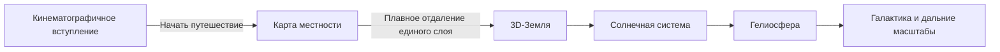

# Перенос 3D-сцен и кинематографичное вступление

> [!abstract] Цель
> Перенести визуальный ремастер 3D-сцен из рабочей копии `cosmic-visual-remaster` в актуальный проект `Spase_is_u-main`, сохранив без функциональных изменений озвучку, субтитры, квесты, мини-игры, тексты и последовательность путешествия.

Связанная запись: [[dev-log|Журнал разработки]].

## Границы работы

### Переносим

- модульные Three.js-сцены и визуальные слои;
- новые текстуры Земли, облаков и космических объектов;
- освещение, атмосферу, звёздные поля и эффекты глубины;
- состояние камеры, адаптивное качество и планировщик рендера;
- визуальные переходы между масштабами;
- подписи, связанные непосредственно с объектами 3D-сцены;
- кинематографичное вступление с Землёй и кораблём;
- бесшовный переход от вступления к карте и от карты к 3D-Земле.

### Не меняем

- аудиофайлы и таблицу реплик;
- управление воспроизведением озвучки;
- субтитры и их переключатели;
- квестовую логику и состояние прохождения;
- мини-игры с ракетой, артефактами, космической сетью и финальной звездой;
- тексты, порядок этапов и существующие идентификаторы объектов;
- сервер запуска, Vite-конфигурацию и публичные пути целевого проекта, кроме необходимых зависимостей визуального слоя.

> [!warning] Запрещённый способ переноса
> Нельзя целиком заменять `src/main.js` или `src/styles.css` файлами визуальной ветки: это удалит элементы и обработчики озвучки и квестов.

## Пользовательский поток

Прокрутка и переход к карте недоступны до нажатия кнопки «Начать путешествие». После нажатия вступительный слой плавно исчезает, карта становится активной, а существующая система повествования получает первую штатную точку запуска.

## Кинематографичное вступление

### Композиция

- Полноэкранное чёрное космическое пространство со звёздным полем.
- Земля занимает нижнюю часть кадра и читается как большой горизонт с выраженным атмосферным свечением.
- Источник тёплого света расположен в верхнем углу и создаёт контровое освещение, близкое к референсу.
- Корабль находится на переднем плане, не перекрывает основную кнопку и остаётся различимым на мобильных экранах.
- Заголовок и кнопка используют существующий визуальный язык проекта и не заменяют интерфейс озвучки.

### Движение

- Земля медленно вращается с постоянной небольшой скоростью.
- Облачный слой вращается отдельно и немного быстрее поверхности.
- Корабль выполняет медленное вращение вокруг продольной оси и лёгкий вертикальный дрейф.
- При `prefers-reduced-motion: reduce` вращение становится почти незаметным, а переходы сокращаются.
- Анимация работает через общий планировщик рендера и не создаёт второй бесконтрольный цикл `requestAnimationFrame`.

### Представление корабля

Используется детализированный 2.5D-корабль с прозрачным фоном, размещённый в 3D-пространстве как плоскость с корректной перспективой. Небольшая амплитуда вращения сохраняет объёмное ощущение и не раскрывает плоскую природу изображения. Это обеспечивает более близкий к референсу уровень детализации без тяжёлой внешней 3D-модели.

## Карта без подгрузки во время отдаления

Карта получает исходное положение пользователя существующим способом. Она загружается только в начальном масштабе и после готовности визуально фиксируется. Во время перехода масштаб карты в Leaflet не изменяется: трансформируется единый контейнер уже загруженного изображения.

Чтобы при уменьшении не появились пустые края, карта заранее создаётся в увеличенной скрытой области вокруг viewport. Переход использует только CSS/WebGL-трансформацию этого слоя. До того как детализации начнёт не хватать, карта плавно совмещается и перекрывается текстурой 3D-Земли.

Если сетевые тайлы не загрузились, используется локальный запасной спутниковый слой; переход к Земле остаётся доступным.

## Архитектура интеграции

### Визуальные модули

- `src/scene/**` отвечает за создание сцены, Землю, Солнечную систему, гелиосферу и текстуры.
- `src/core/stage-state.js` вычисляет текущий этап и камеру.
- `src/core/quality-profile.js` выбирает плотность геометрии и качество текстур.
- `src/core/render-scheduler.js` управляет кадрами и приостанавливает рендер в скрытой вкладке.
- `src/core/earth-journey.js` описывает только визуальное состояние пути «вступление → карта → Земля».
- `src/data/cosmos.js` содержит совместимые идентификаторы сцен и объектов.

### Сохранённые интерфейсы целевого проекта

- Изменение этапа продолжает вызывать `handleNarrationFromStage`.
- Открытие объекта продолжает вызывать `handlePanelNarration`.
- Идентификаторы планет остаются источником состояния квеста с артефактами.
- Обработчики `voiceToggle`, `subtitleToggle`, `rocketCatcher`, `webRunner` и `starMaker` не заменяются.
- Клики по элементам озвучки и мини-игр не попадают в raycast 3D-сцены.

## Стили

Стили визуальной ветки объединяются с целевыми селективно. Допускаются изменения canvas, вступительного слоя, карты, пространственных подписей и панели объектов. Стили озвучки, миссий и мини-игр сохраняются. Адаптивные правила проверяются минимум для широкого экрана и мобильного viewport.

## Ошибки и деградация

- При недоступной текстуре используется локальный резервный материал.
- При недоступной геолокации сохраняется текущая резервная точка проекта.
- При недоступной карте переход не блокируется: показывается локальная подложка.
- При слабом GPU снижается плотность звёзд, сегментация сфер и максимальный pixel ratio.
- Ошибка визуального ассета не должна останавливать озвучку или квестовый автомат состояний.

## Проверка

### Автоматические проверки

- тесты визуальных модулей выполняются до интеграции и после неё;
- защитные тесты подтверждают наличие всех голосовых реплик и аудиофайлов;
- защитные тесты подтверждают сохранность квестовых идентификаторов и точек вызова;
- сборка Vite завершается без ошибок;
- покрытие добавленных модулей составляет не менее 80%.

### Браузерная проверка

- вступление появляется первым и блокирует преждевременный скролл;
- Земля и корабль движутся плавно;
- кнопка переводит к карте и не запускает переход повторно;
- карта во время отдаления не меняет уровень тайлов и не показывает прогрузку квадратов;
- переход карты в 3D-Землю не содержит резкого скачка;
- все последующие сцены соответствуют визуальному ремастеру;
- озвучка, субтитры и четыре квестовых эпизода продолжают работать;
- в консоли нет ошибок, отсутствующих ассетов и необработанных отклонений промисов.

## Критерии приёмки

- Первый кадр композиционно соответствует предоставленному референсу: корабль на фоне крупного горизонта Земли и звёзд.
- До кнопки «Начать путешествие» карта и основной скролл недоступны.
- Земля медленно вращается, корабль плавно вращается вокруг своей оси.
- Карта масштабируется как единый ровный слой без повторной загрузки тайлов.
- Визуальный ремастер перенесён без потери функций актуальной версии с озвучкой.
- Изменения за пределами визуальных сцен и необходимых интеграционных точек отсутствуют.
