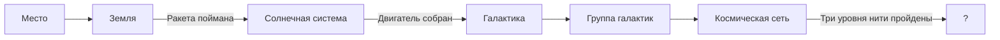

# Реалистичные 3D-сцены и обязательное прохождение мини-игр

## Контекст

Сайт «Космос — это мы» сохраняет последовательное путешествие от Земли к границам наблюдаемой Вселенной, но маршрут становится короче и строже: этап «Гелиосфера» полностью удаляется, а каждый игровой этап необходимо завершить до перехода дальше.

Три дальних этапа — «Галактика», «Группа галактик» и «Космическая сеть» — переходят от плоских полноэкранных изображений и простых glow-точек к настоящим объёмным Three.js-сценам. Утверждённое художественное направление — ==обсерваторная достоверность==: натуральные оттенки, глубокий чёрный космос, реалистичная пыль, сдержанное свечение и ощущение научного наблюдения.

> [!success] Утверждённое решение
> Использовать гибридный настоящий 3D: процедурная геометрия, объёмные частицы и отдельные пространственные объекты дополняются реалистичными текстурами материалов. Камера остаётся кинематографичной и фиксированной на остановках, а лёгкий параллакс подчёркивает глубину.

## Цели

1. Полностью убрать «Гелиосферу» из маршрута, интерфейса, данных, рендера и ассетов.
2. Не разрешать переход на следующий этап, пока не завершена мини-игра текущего обязательного этапа.
3. Сделать «Галактику», «Группу галактик» и «Космическую сеть» визуально объёмными, реалистичными и согласованными между собой.
4. Сохранить работоспособность на сенсорном стенде, настольном компьютере и телефоне через адаптивные профили качества.
5. Сохранить спокойную музейную подачу из [[PRODUCT#Design Principles]].

## Не входит в объём

- Свободная орбитальная камера на информационных остановках.
- Переход на другой 3D-движок.
- Замена существующей структуры сайта новым приложением.
- Новые игровые механики помимо существующих мини-игр.
- Изменение финальной механики создания персональной звезды и купона.

## Новый маршрут

После удаления «Гелиосферы» маршрут содержит семь этапов:

1. Место.
2. Земля.
3. Солнечная система.
4. Галактика.
5. Группа галактик.
6. Космическая сеть.
7. Неизвестное `?`.

## Архитектура прогресса

### Единое правило доступа

Доступность этапа вычисляется отдельной чистой функцией на основе состояния путешествия. UI и обработчики прокрутки не определяют правила самостоятельно, а используют один результат.

Состояния, открывающие следующий этап:

| Текущий этап | Условие перехода дальше | Существующий источник истины |
|---|---|---|
| Место | Путешествие начато | `journeyStarted` |
| Земля | Ракета поймана | `journeyState.rocketCaught` |
| Солнечная система | Собраны детали и решён пазл двигателя | `journeyState.solarComplete` |
| Галактика | Автоматически доступен после Солнечной системы | нет дополнительной игры |
| Группа галактик | Автоматически доступна после Галактики | нет дополнительной игры |
| Космическая сеть | Пройдены все три уровня нити | `journeyState.webComplete` |
| `?` | Финальный этап | отдельная блокировка не требуется |

> [!important] Поведение блокировки
> «Каждая мини-игра» означает все три существующие обязательные игры: ловля ракеты, сбор деталей с финальной сборкой двигателя и три уровня космической нити.

### Каналы навигации

Блокировка применяется ко всем способам продвижения вперёд:

- колесо мыши и прокрутка трекпада;
- вертикальный свайп;
- клавиши прокрутки, включая `ArrowDown`, `PageDown`, `End` и `Space`;
- кнопки шкалы этапов;
- программная прокрутка к закрытому этапу.

Переход назад всегда разрешён. После возвращения на ранее завершённый этап повторное прохождение игры не требуется в пределах текущей сессии.

### Реакция на попытку перейти дальше

1. Позиция страницы ограничивается координатой последнего доступного этапа.
2. Кнопки закрытых этапов получают `disabled`, `aria-disabled="true"` и недоступны с клавиатуры.
3. `missionStatus` показывает короткую конкретную цель текущего этапа.
4. Сообщение не дублируется при каждом событии колеса; повторные попытки обновляют существующую подсказку без визуального шума.
5. После победы следующий этап сразу разблокируется, и текст подтверждает возможность продолжить путешествие.

## Полное удаление «Гелиосферы»

Удаление включает:

- запись `heliosphere` из `STAGES`;
- подпись навигации и дистанцию `120 а.е.`;
- объект Voyager 1 и региональную аннотацию «Гелиосфера»;
- импорт, создание и подключение `createHeliosphereLayer`;
- маркер, траекторию и подпись Voyager;
- изображения `voyager-heliosphere.*` и записи вариантов в манифесте ассетов;
- ссылки в скрипте оптимизации ассетов;
- старые записи не удаляются из исторического [[dev-log]], но новая запись объясняет изменение маршрута.

Все оставшиеся сцены используют идентификаторы этапов или вычисляемую карту `stageId -> index`. Новая логика не должна зависеть от прежних чисел `3`, `4`, `5`, `6` для дальних сцен.

## Художественная система дальних сцен

### Общие принципы

- Чёрный фон сохраняет контраст и ощущение масштаба.
- Цвета ограничены физически правдоподобной палитрой: тёплые старые звёзды, холодные области звездообразования, нейтральная пыль.
- Свечение подчёркивает яркие области, но не выбеливает структуру.
- Статичная остановка не содержит бесцельного постоянного вращения.
- Лёгкий параллакс от указателя или наклона устройства имеет малую амплитуду и отключается при `prefers-reduced-motion`.
- Аннотации остаются читаемыми, но не закрывают центральную композицию.

### Галактика

Сцена Млечного Пути строится как многослойный объёмный объект:

- плотное тёплое ядро;
- четыре основные спиральные области с неравномерной плотностью;
- холодные молодые звёзды и эмиссионные области в рукавах;
- отдельные тёмные пылевые полосы перед светящимися слоями;
- разреженное сферическое гало;
- звёздный foreground для параллакса;
- существующие аннотации центра, рукавов Ориона и Персея, а также гало привязаны к настоящим точкам сцены.

Плоский `milkyWayGlow` перестаёт быть главным изображением. Допустимо использовать реалистичную текстуру как слабый материал одного внутреннего слоя, но силуэт, глубина и параллакс формируются 3D-геометрией.

### Группа галактик

Локальная группа состоит из отдельных объектов, расположенных на разных координатах и глубине:

- Млечный Путь;
- Андромеда;
- Треугольник M33;
- Большое и Малое Магеллановы Облака;
- M32;
- разреженный фон карликовых галактик.

Каждая крупная галактика имеет собственный масштаб, наклон, цветовую температуру, ядро, диск или эллиптический профиль. Реалистичные текстуры используются как материалы billboard-слоёв внутри объёмного объекта, а не как одинаковые круглые glow-спрайты.

Композиция передаёт иерархию: Андромеда и Млечный Путь доминируют, M33 заметна, спутники меньше и слабее. Небольшое смещение указателя создаёт параллакс между ближними и дальними объектами.

### Космическая сеть

Сцена строится как воспроизводимый пространственный граф:

- узлы генерируются детерминированно из фиксированного seed;
- каждый узел связывается с ближайшими соседями вместо случайного соединения любых пар;
- плотные узлы состоят из множества слабых галактических точек;
- нити имеют толщину, мягкое свечение и неоднородную плотность;
- между нитями сохраняются крупные тёмные пустоты;
- foreground, основной граф и дальний фон находятся на разных глубинах.

Полноэкранный `cosmic-web-bright.png` больше не является основной сценой. Его можно оставить только как очень слабый дальний фон на высоком качестве, если он не создаёт дублирования структуры.

Мини-игра космической нити остаётся поверх 3D-сцены. Игровая сетка получает более спокойный контраст, чтобы не разрушать обсерваторное направление, но её геометрия и правила не меняются.

## Камера и движение

- На информационной остановке камера фиксирована.
- Во время переходов используется существующая кинематографичная интерполяция.
- Параллакс затрагивает отдельную корневую группу сцены, а не саму навигационную камеру.
- Максимальное смещение мало и не меняет положение кликабельных подписей относительно объектов.
- При `prefers-reduced-motion` параллакс отключён, переход становится кроссфейдом или мгновенной сменой.

## Адаптивное качество

Используются существующие профили `high`, `medium` и `economy`, но они начинают управлять реальным количеством объектов.

| Параметр | High | Medium | Economy |
|---|---:|---:|---:|
| DPR максимум | 1.5 | 1.25 | 1.0 |
| Звёзды галактики | 2600 | 1700 | 900 |
| Точки космической сети | 9800 | 5200 | 2600 |
| Слои пыли и свечения | все | сокращённый набор | минимальный набор |
| Параллакс | полный малой амплитуды | уменьшенный | отключён |

Количество частиц и геометрии вычисляется из профиля, а не задаётся фиксированными значениями в сцене. Композиция и доступность аннотаций одинаковы во всех профилях.

## Границы компонентов

Существующий монолит дальних сцен в `src/main.js` разделяется по ответственности:

- модуль карты этапов и доступа отвечает только за порядок и блокировки;
- слой «Галактика» создаёт, обновляет и освобождает ресурсы Млечного Пути;
- слой «Группа галактик» управляет отдельными галактиками и аннотациями;
- слой «Космическая сеть» создаёт детерминированный граф и его геометрию;
- `main.js` связывает состояние путешествия, shell и scene manager, не содержит внутреннюю геометрию дальних сцен.

Каждый слой предоставляет одинаковый контракт: корневая `Object3D`, список интерактивных объектов, `setPresence`, необязательный `updateParallax` и `dispose`.

## Обработка ошибок

- Ошибка загрузки необязательной реалистичной текстуры не ломает этап: слой остаётся процедурно видимым.
- Ошибка WebGL или недостаток ресурсов использует economy-профиль и существующую пользовательскую обработку недоступного рендера.
- Некорректное значение целевого этапа ограничивается последним допустимым индексом.
- Пустое или частично восстановленное состояние путешествия считается непройденным и не открывает следующие этапы.

## Доступность

- Закрытый этап имеет понятное доступное имя с причиной блокировки.
- Разблокировка объявляется через существующую live-region `missionStatus`.
- Игры полностью управляются существующими доступными способами; блокировка не создаёт клавиатурной ловушки.
- Контраст подписей и управляющих элементов соответствует ориентирам [[PRODUCT#Accessibility & Inclusion]].
- Параллакс и дополнительное движение уважают `prefers-reduced-motion`.

## Стратегия тестирования

### Модульные тесты

- вычисление максимального доступного этапа для каждого игрового состояния;
- разрешение движения назад и запрет движения вперёд;
- преобразование идентификаторов этапов после удаления «Гелиосферы»;
- детерминированность графа космической сети;
- соответствие количества частиц профилю качества;
- освобождение ресурсов каждым слоем.

### Интеграционные тесты

- shell помечает закрытые кнопки этапов как недоступные;
- попытка прокрутки удерживает пользователя на текущем обязательном этапе;
- победа в игре снимает блокировку без перезагрузки;
- аннотации дальних сцен привязаны к правильным этапам после изменения маршрута.

### E2E-тесты

1. Пользователь не может покинуть Землю до ловли ракеты.
2. Пользователь не может покинуть Солнечную систему до полной сборки двигателя.
3. Пользователь может пройти Галактику и Группу без дополнительной игры.
4. Пользователь не может открыть `?` до завершения всех трёх уровней космической нити.
5. Переход назад работает на каждом этапе.
6. В навигации и шкале расстояний нет «Гелиосферы» и `120 а.е.`.
7. На desktop и mobile viewport отсутствуют горизонтальный скролл, перекрытие игры и критические ошибки консоли.

### Визуальная проверка

- скриншоты трёх дальних этапов на `1440×900` и мобильном viewport;
- глубина и отдельные планы различимы без постоянного движения;
- нет растянутых низкокачественных изображений;
- подписи не перекрывают ядро галактики, главные объекты группы и ключевые узлы сети;
- economy-профиль сохраняет ту же композицию.

## Критерии приёмки

- В UI, данных, сценах и загружаемых ассетах отсутствует «Гелиосфера» и Voyager 1.
- Маршрут содержит ровно семь утверждённых этапов.
- Каждый из трёх игровых барьеров невозможно обойти прокруткой, свайпом, клавиатурой или шкалой этапов.
- После победы следующий этап открывается сразу.
- Три дальние сцены являются настоящими объёмными Three.js-сценами, а не полноэкранными изображениями.
- Галактики Локальной группы визуально различаются формой, размером, наклоном и глубиной.
- Космическая сеть воспроизводима между загрузками и показывает связные нити с заметными пустотами.
- Все профили качества используют заданные ограничения и не меняют смысл сцены.
- Сборка, модульные, интеграционные и E2E-тесты проходят без ошибок.
- Для изменённого кода достигается покрытие не ниже 80%.

## Связанные заметки

- [[PRODUCT]]
- [[dev-log]]

